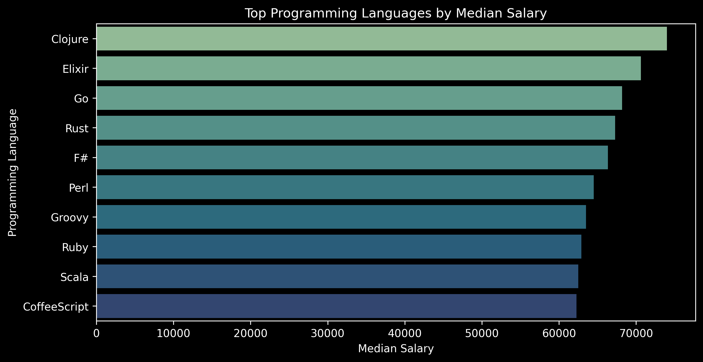
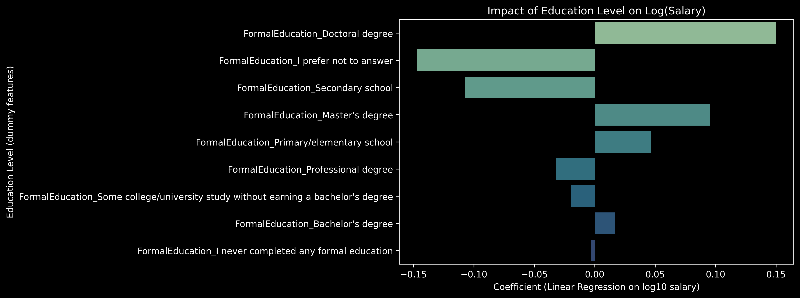
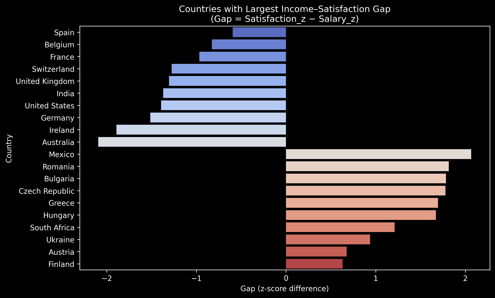

# What Makes Developers Happy? A Data Story from the Stack Overflow Survey 2017
*Written by Johannes Golling, October 2025*

Every year, thousands of developers share their experiences in the Stack Overflow Developer Survey.  
In this project, I wanted to understand what really drives developer salaries and happiness.

Is it the programming language we use?  
Does a university degree make a big difference?  
And are developers in wealthy countries automatically happier?

Using data from more than 40,000 responses from the 2017 survey, I explored these questions to find out what matters most.

---

## 1. Programming Languages and Salary

One of the first questions I asked was whether some programming languages pay better than others.

When looking at median salaries, languages such as Go, Scala, and Groovy appeared at the top.  
However, once I adjusted for country and education, the differences became much smaller.

**Insight:**  
The language itself does not decide your salary. It mostly reflects experience, specialization, and location.

---

## 2. Education and Its Role

The next question focused on education.  
Do developers with formal degrees earn more or feel more satisfied in their work?

The data showed that developers with Master’s or Doctoral degrees tend to earn more.  
At the same time, education has almost no connection to job satisfaction.  

Developers without formal degrees can be just as happy and successful as those with academic titles.  
This shows that personal motivation, autonomy, and workplace culture have a strong influence on satisfaction.

---

## 3. Countries, Income, and Satisfaction

Finally, I compared income and satisfaction levels across countries.

The results were surprising. Developers in Eastern Europe and emerging markets, such as Romania, Bulgaria, and Mexico, often report high satisfaction despite modest pay.  
On the other hand, developers in countries with high salaries, such as Germany, the United States, and Australia, often report lower relative satisfaction.

**Conclusion:**  
Higher income does not automatically mean higher happiness.

---

## What This Means

Across all three questions, a clear picture appears.

- Location has the strongest impact on salary.  
- Education helps financially but has little effect on happiness.  
- Happiness depends more on qualitative aspects of work than on income.  

The most satisfied developers seem to be those who find a good balance between learning, working, and living, regardless of where they live or what they code in.

---

## Final Thoughts

Data can tell powerful stories about people.  
Behind every record in a survey are real developers with individual goals and values.  

For me, this project was a reminder that while we often focus on skills and salaries, satisfaction and purpose are equally important parts of a successful career.

---

*Based on the Stack Overflow Developer Survey 2017.*
